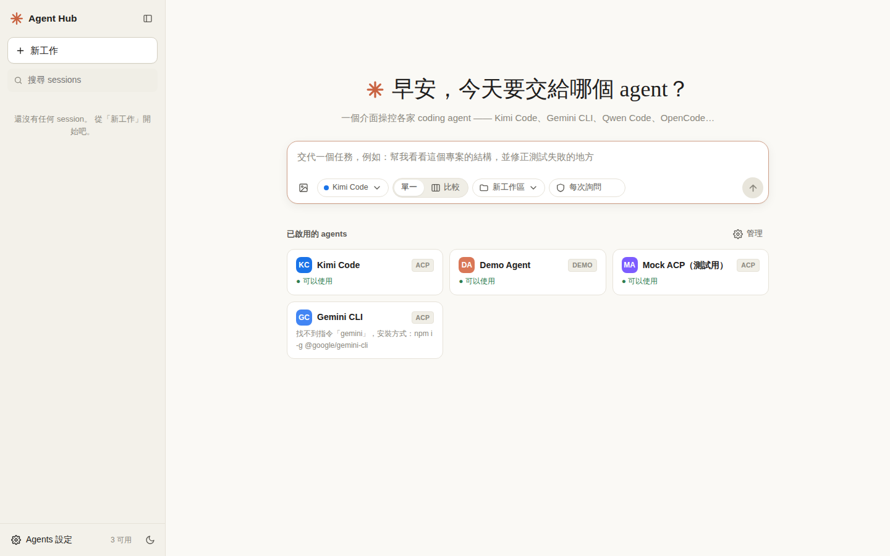
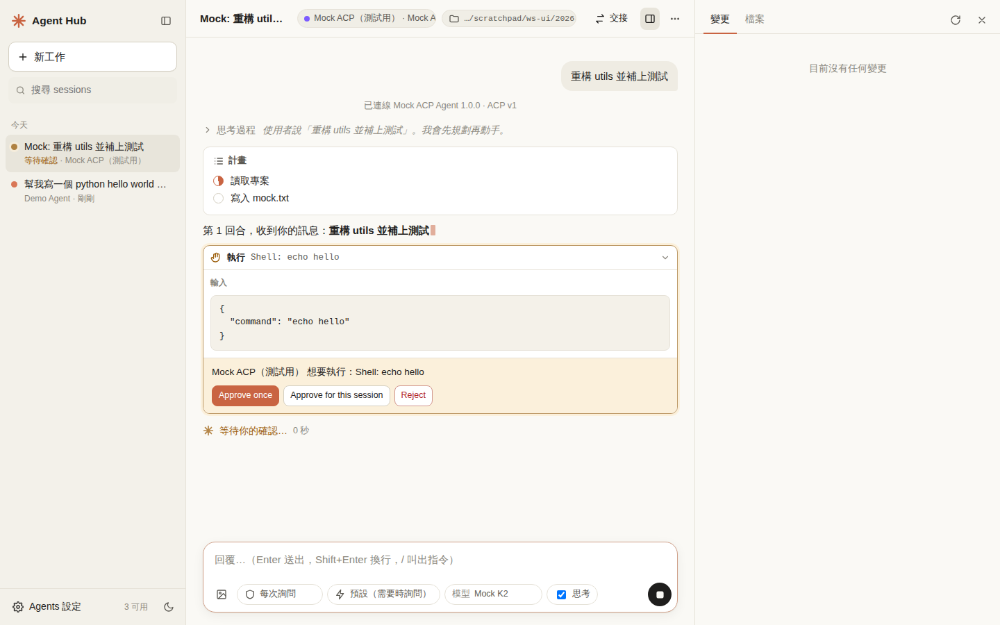
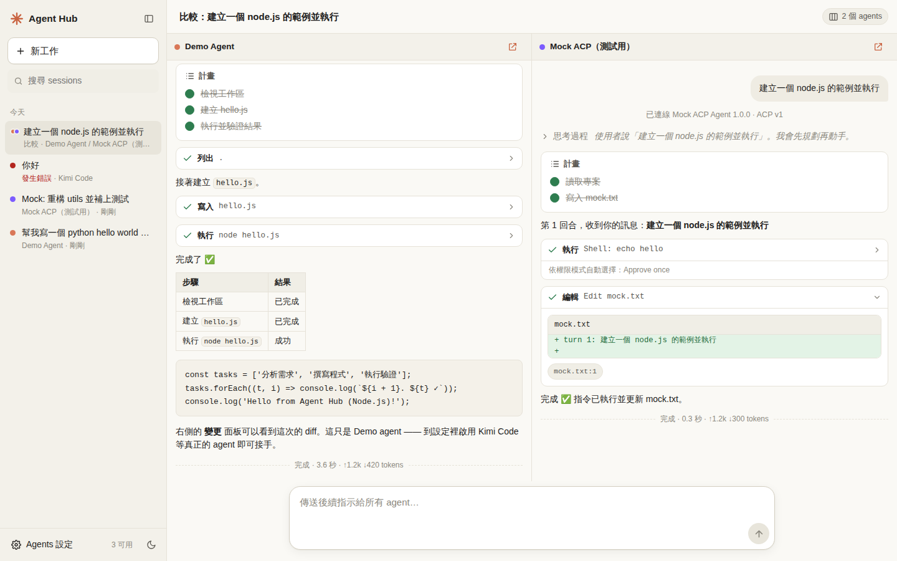

# Agent Hub — 多家 coding agent 的網頁中控台

在瀏覽器裡用同一個介面（版面參考 Claude Code 網頁版）操控各家的 coding agent：**Kimi Code**、Gemini CLI、Qwen Code、Goose、OpenCode、Codex……以及任何 OpenAI 相容 API 的模型。



## 重點

- **Kimi 訂閱制可直接用**：透過 Kimi Code CLI 的 `kimi acp` 連線，沿用你用 Kimi 帳號登入的狀態，**不需要 API key**。
- **即時、內容一致**：agent 的每個串流片段一到就推送到瀏覽器，不做批次或改寫。實測 agent → 瀏覽器延遲 p50 約 1 ms、p95 約 2 ms（本機）。
- **權限請求照原樣顯示**：agent 要執行指令或改檔時，網頁會顯示 **agent 自己提供的選項**（例如 Kimi 的「允許一次 / 本 session 都允許 / 拒絕」）。
- **通用**：任何支援 [Agent Client Protocol (ACP)](https://agentclientprotocol.com) 的 agent 都能接上；其他 CLI 和 OpenAI 相容 API 也支援。
- **多 agent 中控**：側欄管理所有 session；同一個任務可以交給多個 agent **並排比較**；可以**交接**給另一個 agent 繼續做；API 型 agent 可以**委派**子任務給其他 agent。
- **工作區面板**：即時顯示 git diff（變更）與檔案瀏覽。
- 深色模式、手機版面、中文輸入法（IME）選字時按 Enter 不會誤送出。

| 權限請求（ACP agent 自己的選項） | 多 agent 並排比較 |
| --- | --- |
|  |  |

## 快速開始

需要 Node.js 20 以上。

```bash
npm install
npm start
# → 打開 http://127.0.0.1:8787
```

第一次打開時，內建的 **Demo Agent** 不需要任何帳號就能用。它會真的在工作區建立檔案、執行指令並請求權限，可以先用它熟悉介面。

## 接上 Kimi（訂閱制）

1. **安裝 Kimi Code CLI**（Moonshot 官方的新版 CLI，舊的 Python 版 `kimi-cli` 已停止維護）

   ```bash
   curl -fsSL https://code.kimi.com/kimi-code/install.sh | bash
   # 或：npm i -g @moonshot-ai/kimi-code   (需要 Node ≥ 22.19)
   ```

2. **用 Kimi 帳號登入**（擇一）
   - 終端機執行 `kimi login`，依指示打開網址、輸入代碼授權；或執行 `kimi` 後輸入 `/login`，選擇 **Kimi Code OAuth**。
   - 或在中控台按 **Agents 設定 → Kimi Code → 登入**。中控台會執行 `kimi login`，把授權網址和代碼顯示在網頁上。
3. 在 **Agents 設定 → Kimi Code** 按 **測試連線**，應該會看到「連線成功：Kimi Code CLI x.y.z（ACP v1），已登入，可以使用。」
4. 回到首頁，選 **Kimi Code**，輸入任務即可。

> 如果中控台找不到 `kimi`（例如從桌面捷徑啟動，PATH 不同），在設定的「啟動指令」填入完整路徑（終端機執行 `which kimi` 可以查到）。

### 送出去的內容和顯示的內容，跟直接用 Kimi 一樣嗎？

中控台扮演的角色和 Zed、JetBrains 這類編輯器相同，都是 **ACP 客戶端**：

```
瀏覽器 ──WebSocket──▶ Agent Hub ──stdin/stdout (JSON-RPC)──▶ kimi acp ──▶ Kimi 伺服器（你的訂閱）
       ◀─即時推送──            ◀──── session/update 串流 ────
```

- **輸入**：你打的文字原封不動送進 `session/prompt`。圖片會以 ACP image 區塊送出（Kimi 支援）。輸入 `/` 會列出 Kimi 回報的 slash 指令。
- **輸出**：Kimi 的回覆片段（`agent_message_chunk`）、思考過程、工具呼叫和結果、diff、計畫、context 用量、session 標題，收到後立刻轉給瀏覽器。端到端測試會逐位元組比對「瀏覽器即時收到的內容」與「agent 送出的內容」，兩者完全一致。
- **控制**：中斷鍵送出 `session/cancel`（實測約 30 ms 生效）；模式、模型、思考開關這些 Kimi 回報的設定，會直接顯示在輸入框下方，可以切換。
- **續接**：同一個 session 會保留同一個 Kimi 程序，後續訊息不用重新啟動。程序閒置 30 分鐘或中控台重新啟動後，會用 `session/resume` 接回原本的對話。

不會出現在網頁上的，只有 Kimi **終端機介面（TUI）本身的畫面元素**，例如狀態列、快捷鍵、TUI 專屬的互動選單。這些不屬於 ACP 協定。

## 支援的 agents

| 類型 | 內建範本 | 連線方式 | 登入 / 計費 |
| --- | --- | --- | --- |
| **ACP** | Kimi Code、Gemini CLI、Qwen Code、Goose、OpenCode、Codex (ACP 轉接器)、自訂 | 啟動 agent 程序，用 ACP 雙向串流 | 沿用 agent 自己的帳號（訂閱制可用） |
| **CLI** | Aider、自訂指令 | 每回合執行一次指令，解析 JSON lines 或純文字輸出 | 依該 CLI 而定 |
| **OpenAI 相容 API** | Kimi API、OpenAI、DeepSeek、OpenRouter、Ollama… | 中控台自己跑 agent 迴圈，提供工具（執行指令、讀寫檔案、搜尋、委派其他 agent） | API key（按量計費） |
| Demo | Demo Agent | 內建模擬 | 不需要 |

各 CLI 的 ACP 啟動參數會隨版本改變（例如 Gemini CLI 是 `--experimental-acp`），都可以在設定裡修改。其他支援 ACP 的 agent 請用「新增 agent → 自訂 ACP Agent」，填入啟動指令就能接上。

## 功能說明

- **權限模式**（輸入框下方的盾牌圖示）
  - 每次詢問：agent 提出權限請求時，網頁會顯示它的選項，等你決定。
  - 自動接受編輯：讀取、搜尋、編輯類操作自動允許，執行指令仍會詢問。
  - 全部自動允許：所有請求都自動以「允許一次」回覆，不會改動 agent 自己記住的永久規則。
- **工作區**：可以選擇「新工作區」（自動建立資料夾並 `git init`），或選擇既有的專案資料夾。
- **比較模式**：首頁切到「比較」，勾選多個 agent。若選的是 git 專案，每個 agent 會在各自的 **git worktree** 工作，互不干擾。
- **交接**：session 右上角的「交接」可以把目前對話交給另一個 agent，在同一個工作區繼續。
- **委派**：OpenAI 相容 API 型的 agent 有 `delegate_to_agent` 工具，可以把子任務交給其他 agent（例如交給 Kimi），子 session 會顯示在側欄。
- **待確認提醒**：不在畫面上的 session 需要你確認時，會跳出通知，分頁標題也會顯示數量。

## 設定

| 環境變數 | 預設 | 說明 |
| --- | --- | --- |
| `PORT` | `8787` | 埠號 |
| `HOST` | `127.0.0.1` | 監聽位址 |
| `AGENT_HUB_TOKEN` | （空） | 存取權杖。`HOST` 不是本機位址時，若沒有設定會自動產生 |
| `AGENT_HUB_DATA` | `./data` | sessions 與 agents 設定的存放位置 |
| `AGENT_HUB_WORKSPACES` | `./workspaces` | 「新工作區」建立的位置 |
| `OPENAI_API_KEY`、`MOONSHOT_API_KEY`… | | API 型 agent 的金鑰（也可以在設定中填寫） |

### 安全性

Agent 可以在你的電腦上執行指令。因此：

- 預設只監聽 `127.0.0.1`。
- 要從其他裝置（例如手機）使用時，建議用 SSH tunnel 或 Tailscale。若改用 `HOST=0.0.0.0`，中控台會強制使用權杖，並在終端機印出含 `#token=` 的網址。
- 在設定裡填寫的 API key 會以明文存在本機 `data/agents.json`；用環境變數比較安全。

## 測試

```bash
npm test
```

- `test/e2e-acp.test.mjs`：啟動真正的中控台伺服器和 WebSocket，連接一個依照 ACP 官方 schema 撰寫的模擬 agent（`test/fixtures/mock-acp-agent.mjs`）。驗證以下項目：
  - 串流內容逐位元組一致、順序正確，並量測延遲
  - 權限選項原樣呈現
  - 續接時重用同一個程序
  - 圖片輸入、中斷、模式與模型切換、全部自動允許模式
  - 中控台重啟後續接對話、未登入時的提示
- `test/e2e-openai.test.mjs`：用本機假的 `/chat/completions` 驗證 OpenAI 相容 adapter 的串流、工具呼叫與工具結果回傳。

模擬 agent 也可以當成「自訂 ACP Agent」加進中控台來體驗：指令填 `node`，參數填 `test/fixtures/mock-acp-agent.mjs` 的完整路徑。

### 驗證範圍

- 已用真正的 **Kimi Code CLI 2.1.1** 驗證：`initialize` 握手、能力協商，以及未登入時的錯誤與登入指引，都能正確顯示在網頁上。
- 開發環境的網路政策擋住了 `auth.kimi.com`，所以**還沒有用真實 Kimi 帳號跑完整的對話**。協定層的完整流程已由上述模擬 agent 的端到端測試涵蓋。實際登入後，如果遇到任何差異，歡迎回報。

## 專案結構

```
server/
  index.js          HTTP API、WebSocket、靜態檔案、登入流程
  runner.js         回合執行、權限閘門、中斷、委派、交接、比較群組
  store.js          JSON 檔案儲存（sessions / agents）
  tools.js          API 型 agent 使用的工作區工具
  workspace.js      工作區建立、檔案瀏覽、git diff
  adapters/
    acp.js          ACP 客戶端（Kimi Code 等）
    openai.js       OpenAI 相容 Chat Completions 迴圈
    cli.js          一般 CLI
    demo.js         Demo agent
    presets.js      內建 agent 範本
public/             前端（原生 ES modules，不需要建置）
test/               端到端測試與模擬 ACP agent
```
