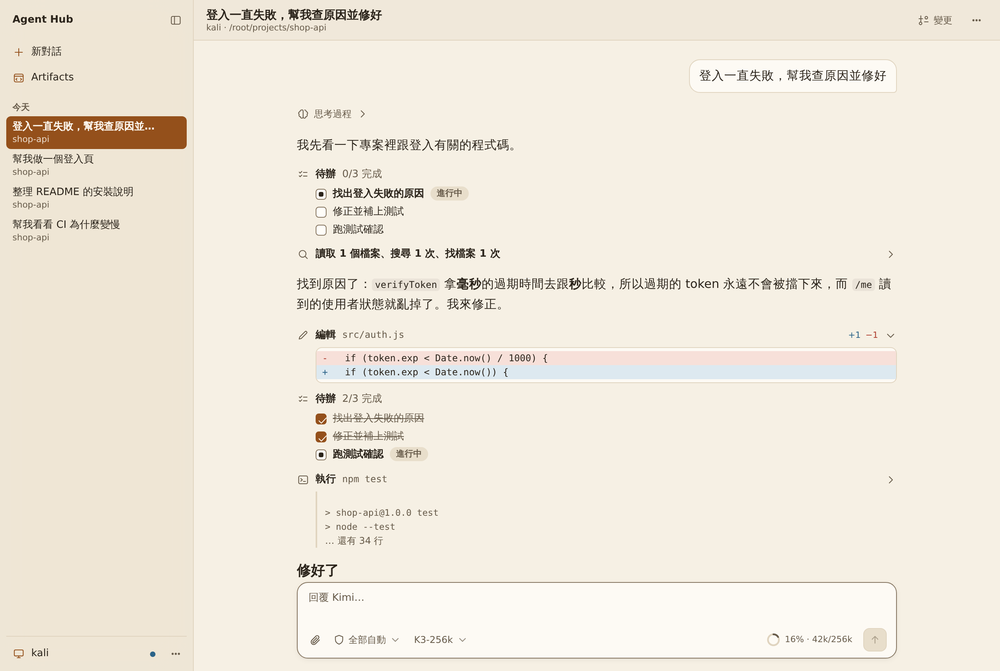
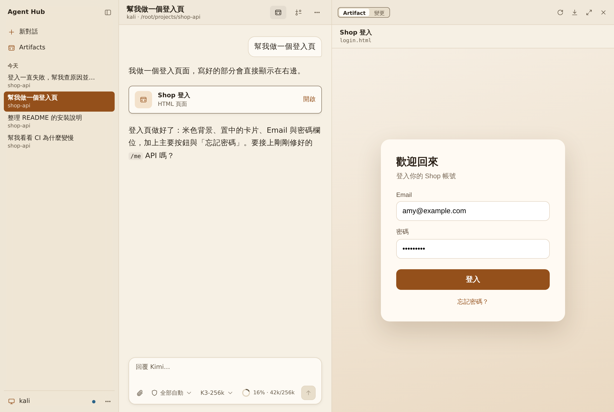
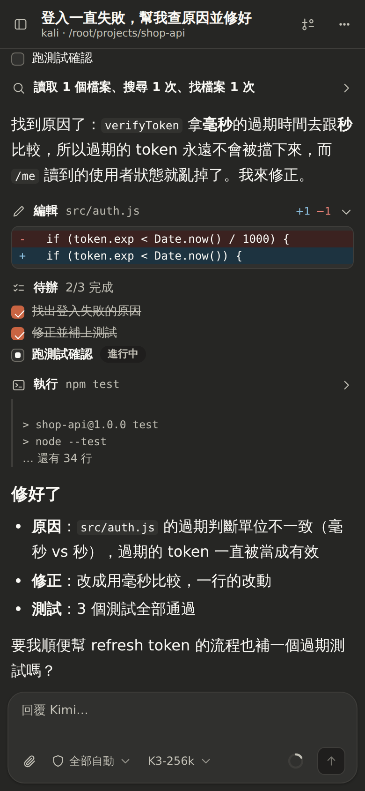

# Agent Hub

在瀏覽器（電腦或手機）操作你每台電腦上的 Kimi Code。



| Artifact 即時預覽 | 手機・深色 |
| --- | --- |
|  |  |

## 安裝

需要 [Node.js 22+](https://nodejs.org)、Git，以及登入好的 [Kimi Code](https://github.com/MoonshotAI/kimi-code)（`kimi login`）。

**Linux / macOS**

```bash
git clone -b claude/hopeful-newton-kqqnmj https://github.com/jim890906abc/test.git agent-hub
cd agent-hub && npm run public
```

**Windows（PowerShell）**

```powershell
git clone -b claude/hopeful-newton-kqqnmj https://github.com/jim890906abc/test.git agent-hub
cd agent-hub; powershell -ExecutionPolicy Bypass -File scripts\start-public.ps1
```

跑完會印出網址、登入密碼，以及給其他電腦的連接指令。

**更新**：在 `agent-hub` 資料夾裡執行 `git pull`，再執行一次上面的啟動指令。

## 連接其他電腦

在那台電腦執行中控台印出的連接指令（左下角「連接電腦…」也看得到）。之後那台電腦的 Kimi 對話會自動出現。

想讓終端機和網頁同時操作同一個對話，用 `kimi-hub` 取代 `kimi` 啟動：

```bash
echo "alias kimi-hub='node ~/.agent-hub/agent-hub-bridge.mjs kimi'" >> ~/.zshrc && source ~/.zshrc
```

## 自動暫停與定時送出

都由中控台執行，關掉網頁也照常運作，重開中控台也會保留。

- **自動暫停**（對話右上角「…」→「自動暫停…」，或 `/autopause 90`）：Kimi 工作時，5 小時額度用到設定的 % 就在對話裡插隊送出「優雅暫停」；5 小時額度恢復後送出「繼續」。每個 5 小時視窗最多暫停一次；暫停期間如果有人又讓 Kimi 開始工作，就不會自動送「繼續」。
- **額度恢復後送出**（點輸入框旁的 context 圓圈 →「額度恢復後送出「繼續」」，或 `/later reset 繼續`）：你已經自己讓 Kimi 停下時用。等 Kimi 停下、5 小時額度確實恢復後送出。
- **定時送出**（「…」→「定時送出…」，或 `/later 30 繼續`、`/later 15:30 繼續`）：幾分鐘後或指定時間送出一則訊息。Kimi 正在工作時，會排在這一輪之後。

### 方案用量一直是 0%

Kimi 的用量回應裡同時有百分比（`usages.limit_5h.used_ratio`…）和已用次數（週額度的 `usage`、5 小時視窗的 `limits[]`）。Kimi Code 只看百分比，而這個百分比常卡在 0（[kimi-code#3817](https://github.com/MoonshotAI/kimi-code/issues/3817)、[#3908](https://github.com/MoonshotAI/kimi-code/issues/3908)、[#3951](https://github.com/MoonshotAI/kimi-code/issues/3951)、[#4133](https://github.com/MoonshotAI/kimi-code/issues/4133)），所以 Kimi 終端機的 `/usage` 和網頁版也顯示 0%。中控台會另外讀同一份回應裡的次數：同一個視窗（重置時間相同）兩者不一致時取較高的那個，畫面上標「依次數」；自動暫停也照這個數字判斷。

讀法：連接器用 Kimi 存在 `~/.kimi-code/credentials/` 的登入，向 Kimi 自己用的網址（`api.kimi.com` 或 `api.kimi.ai`）要同一份用量。只讀不寫、不換發登入，登入資料不會送到 Kimi 以外的地方，也不會傳給中控台；回應的重置時間和 Kimi 剛回報的對不上（不是同一個帳號）就不採用。如果 Kimi 沒附次數，畫面會照 Kimi 的數字顯示，這時請以 Kimi 網站會員頁為準。
